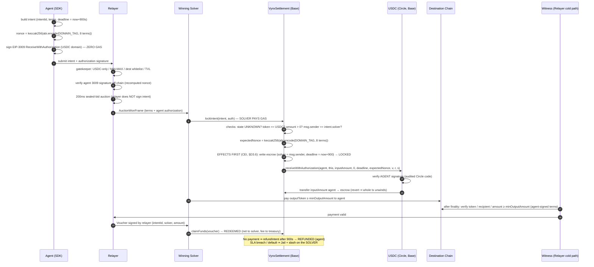

# GASLESS REDESIGN — Cryptographic Design & Technical Specification

> **PROJECT GASLESS REDESIGN — FASE 0 deliverable.**
> Status: DESIGN — no code in this phase. This document is the canonical
> cryptographic specification for FASE 1 (contract), FASE 2 (SDK), FASE 3
> (relayer), FASE 4 (solver), and FASE 5 (e2e). Where this document and the
> deployed code disagree **after FASE 1 lands**, the code wins and this
> document must be updated to follow it (master-spec convention).
>
> Master spec: `V1/PROJECT-GASLESS-REDESIGN.md`. Target model: the agent signs
> **one** EIP-3009 `receiveWithAuthorization` whose nonce is the keccak256 hash
> of all trade terms; the winning solver executes `lockIntent` and pays gas;
> the relayer validates and orchestrates but **no longer signs intents**.
>
> Reviewed by the `security-auditor` agent (FASE 0, design-vs-code review,
> read-only). All HIGH/MED findings are incorporated: CEI ordering pinned
> (§D3.6), nonce domain tag added (§D2.1/§D2.4), USDC blacklist/pause
> inheritance documented (§D3.5, §D8 #17), malleability delegation covered
> (§D6.2 item 6, §D8 #16), deployment-binding clarified (§D2.4, §D8 #19).

---

## 0. Verification Record (V1–V4)

Every claim below was verified by reading the current code. Citations are
`path:symbol`. Discrepancies between the master spec's narrative and the code
are flagged explicitly — **the code wins**.

### V1 — Current `lockIntent`: relayer signature + `safeTransferFrom(agent, …)` ✅ CONFIRMED

`src/l2/VynxSettlement.sol` — `lockIntent(Intent calldata, bytes calldata relayerSig)`:

- Recovers the EIP-712 signer and requires it to equal the **relayer** key:
  `if (signer != IVynxAdmin(admin).relayerKey()) revert InvalidIntentSignature(intent.intentId);`
  (`VynxSettlement.sol:128-129`). The agent signs nothing that the contract
  verifies today.
- Pulls funds with
  `IERC20(intent.token).safeTransferFrom(intent.agent, address(this), intent.amount);`
  (`VynxSettlement.sol:141`), which requires a prior on-chain `approve()` by
  the agent (gas paid by the agent — `vynx-sdk/src/lock_client.ts` submits
  `lockIntent` from the agent's `WalletClient`).
- `lockIntent` is already **permissionless**: there is no `msg.sender` check.
  Anyone presenting a valid relayer signature can execute it.

**Discrepancy (V1.a) — unenforced signed deadline.** The Intent's `deadline`
field is part of the signed EIP-712 payload (`VynxSettlement.sol:124`) and is
documented as the "EIP-712 signature validity cutoff" (`VynxTypes.sol:27`),
but `lockIntent` **never checks it**. The escrow deadline is independently set
to `block.timestamp + DEFAULT_DEADLINE` (`VynxSettlement.sol:131`,
`DEFAULT_DEADLINE = 900` at `VynxSettlement.sol:47`). A relayer signature is
therefore replayable forever (until the intent is locked once). The redesign
fixes this structurally — see §D4.

### V2 — 6-field `INTENT_TYPEHASH` vs 8-field on-chain struct ✅ CONFIRMED

- `INTENT_TYPEHASH` (`VynxSettlement.sol:33-35`):
  `Intent(uint256 nonce,address user,address token,uint256 amount,uint256 destinationChainId,uint256 deadline)`
  — exactly **6 fields**.
- On-chain `struct Intent` (`src/types/VynxTypes.sol:28-37`) has **8 fields**:
  `intentId, agent, token, amount, solver, nonce, destinationChainId, deadline`.
  Therefore `intentId` and `solver` are **outside the cryptographic domain**
  today (root of the §D5 analysis; `intentId` replay safety rests solely on the
  `IntentState` machine, `VynxTypes.sol:12-17`).
- Cross-checked, all four signers/verifiers agree byte-for-byte:
  - Go relayer: `vynx-relayer/internal/signer/eip712.go:67-94`
    (`ComputeIntentHash` — order `nonce, agent, token, amount, destChainID,
    deadline`) against
    `vynx-relayer/internal/types/signer.go:47` (`IntentTypeString`).
  - Foundry helper: `test/unit/VynxSettlement.t.sol:87-102` (`_signIntent`).
  - Invariant: `test/invariant/Invariants.t.sol:200-213`
    (`invariant_typehashImmutability`).

**Note (V2.a) — `user` vs `agent` naming.** The typehash names the second
field `user` while every struct (Solidity and Go) names it `agent`
(`vynx-relayer/internal/types/domain.go:21` documents this). Not a bug —
EIP-712 type strings only need to be consistent across signers — but the
redesign retires this typehash anyway, removing the inconsistency.

**Note (V2.b).** The relayer's `Intent` type already carries `OutputToken` /
`MinOutputAmount` flagged `// not in INTENT_TYPEHASH`
(`vynx-relayer/internal/types/domain.go:26-28`); the witness validates the
destination payment against `MinOutputAmount` purely off-chain
(`vynx-relayer/internal/relayer/coldpath/witness/witness.go:157-186`). These
terms are exactly the ones §D1 moves into the cryptographic domain.

### V3 — USDC is Circle-native with EIP-3009; `VynxToken` is 2612-only ✅ CONFIRMED

- The protocol's USDC on Base is Circle's native deployment
  `0x833589fCD6eDb6E08f4c7C32D4f71b54bdA02913`:
  `script/DeployL2.s.sol:68` (`USDC_BASE`), `test/integration/FullFlow.t.sol:24`,
  `vynx-sdk/src/constants.ts:29`. That contract is Circle `FiatTokenV2_2`,
  which implements **EIP-3009** (`transferWithAuthorization`,
  `receiveWithAuthorization`, `cancelAuthorization`) in addition to EIP-2612
  `permit`. The gasless single-signature path is viable on the already-chosen
  token with zero token migration.
- The only signature-capable mock token in this repo, `src/tokens/VynxToken.sol:12`
  (`contract VynxToken is ERC20, ERC20Permit, Ownable`), supports **only
  EIP-2612 `permit`**. A repo-wide grep for `receiveWithAuthorization` /
  `transferWithAuthorization` / `3009` across `src/` and `test/` returns
  nothing. There is **no EIP-3009-capable test asset today** — hence §D6.

### V4 — Off-chain gatekeeper validations ✅ CONFIRMED

`vynx-relayer/internal/relayer/hotpath/gatekeeper/gatekeeper.go` —
`ValidateIntent` (lines 108-122):

- **USDC-only**: `intent.Token != g.inputToken → ErrTokenNotWhitelisted`.
- **MIN/MAX**: `MIN_INTENT_USDC = 50_000_000` / `MAX_INTENT_USDC = 500_000_000`
  ($50–$500, 6-decimal atomic units, `vynx-relayer/internal/types/constants.go:26-29`).
- **Destination whitelist**: 5 chains (Base, Ethereum, Arbitrum, Optimism,
  Polygon — `gatekeeper.go:60-66`).
- Additionally on bids: TVL cap, SHF ≥ 1.20×, jail status, 80% exposure limit
  (`gatekeeper.go:130-160`).

These validations are **retained unchanged** in the redesign (master spec
§1.5). They are liveness/policy filters; the redesign adds the on-chain
cryptographic floor underneath them (§D1–§D3).

---

## D1. The Expanded `Intent` Struct

### D1.1 Final on-chain struct

```solidity
/// @notice A cross-chain settlement intent authorized by an AI agent via a
///         single EIP-3009 receiveWithAuthorization signature whose nonce
///         binds every term below except `solver` (see provenance note).
struct Intent {
    bytes32 intentId;           // SIGNED (via 3009 nonce hash)
    address agent;              // SIGNED (3009 `from` + nonce hash)
    address token;              // SIGNED (nonce hash) — MUST equal USDC (on-chain lock)
    uint256 inputAmount;        // SIGNED (3009 `value` + nonce hash) — double protection
    address outputToken;        // SIGNED (nonce hash) — NEW in crypto domain
    uint256 minOutputAmount;    // SIGNED (nonce hash) — NEW in crypto domain
    uint256 destinationChainId; // SIGNED (nonce hash)
    uint256 deadline;           // SIGNED (3009 `validBefore` + nonce hash) — double protection
    address solver;             // NOT SIGNED — orchestration metadata (post-auction)
}
```

### D1.2 Signed vs orchestration fields

| Field | Signed by agent? | Mechanism | Rationale |
|---|---|---|---|
| `intentId` | ✅ | nonce hash | Binds the authorization to exactly one protocol intent. Fixes V2's gap where `intentId` was outside the signed domain. |
| `agent` | ✅ (twice) | 3009 `from` + nonce hash | `from` is in the 3009 envelope; inclusion in the nonce hash makes the hash a globally unique, self-contained term-set commitment. |
| `token` | ✅ | nonce hash | Plus the on-chain lock `intent.token == USDC` (§D3.4). |
| `inputAmount` | ✅ (twice) | 3009 `value` + nonce hash | Same number in both places — see §D3.3. |
| `outputToken` | ✅ **NEW** | nonce hash | See D1.3. |
| `minOutputAmount` | ✅ **NEW** | nonce hash | See D1.3. |
| `destinationChainId` | ✅ | nonce hash | Destination leg is part of the trade's economics. |
| `deadline` | ✅ (twice) | 3009 `validBefore` + nonce hash | See §D4. |
| `solver` | ❌ | — | Unknowable at signing time (pre-auction). See §D5. |

### D1.3 Why `outputToken` and `minOutputAmount` enter the cryptographic domain

Today these two fields are pure relayer-flow metadata
(`domain.go:26-28`, "not in INTENT_TYPEHASH"). The witness validates the
destination payment against them (`witness.go:163-186`) — but the values it
validates against are **whatever the relayer stored at intake**. A compromised
relayer could degrade `minOutputAmount` (or swap `outputToken`) between intake
and witness, and the agent's signature would still verify, because the agent
never signed those terms. This is precisely the master spec's trust problem
(§1.4: the relayer — not the agent — sets the output terms).

After the redesign, both fields are inputs to the 3009 nonce hash. Altering
either one changes the recomputed nonce inside `lockIntent`, which makes
Circle's USDC reject the agent's signature, which makes the lock — and
therefore the whole intent — impossible. The witness then validates against
terms that are **cryptographically the agent's**, end to end. This converts
the trust proposition from "trust our relayer" to "your intent is yours".

### D1.4 The legacy `nonce` field is dropped

The current `uint256 nonce` ("monotonically increasing counter",
`VynxTypes.sol:25`) exists to prevent relayer-signature replay. In the new
model the relayer no longer signs intents, and replay is prevented by two
independent on-chain mechanisms:

1. **USDC's authorization state** — `FiatTokenV2` marks
   `_authorizationStates[agent][nonce] = true` on use; a second
   `receiveWithAuthorization` with the same nonce reverts inside USDC.
2. **The `IntentState` machine** — a second `lockIntent` with the same
   `intentId` reverts with `IntentAlreadyExists`
   (`VynxSettlement.sol:112-114` pattern, retained).

A third, sequential counter adds nothing and would force per-agent nonce
tracking in the SDK. It is removed from the struct. (Off-chain systems that
want a sequence number can keep one in their own storage; it has no
cryptographic role.)

---

## D2. The Exact EIP-3009 Nonce Schema

### D2.1 Definition

```solidity
/// @dev Protocol domain tag — makes the nonce pre-image self-domain-separating
///      (no other protocol reusing this trick can produce a colliding pre-image,
///      independently of the 3009 `to` binding). Security-audit finding F5.
bytes32 constant INTENT_NONCE_DOMAIN_TAG = keccak256("VYNX_SETTLEMENT_V1_INTENT_NONCE");

nonce = keccak256(
    abi.encode(
        INTENT_NONCE_DOMAIN_TAG, // bytes32 (constant)
        intentId,                // bytes32
        agent,                   // address
        USDC,                    // address  (the canonical input-token address)
        inputAmount,             // uint256
        outputToken,             // address
        minOutputAmount,         // uint256
        destinationChainId,      // uint256
        deadline                 // uint256
    )
);
```

### D2.2 Canonical field table — THE cross-repo contract

This table is the **single source of truth** for FASE 1 (Solidity) and FASE 2
(SDK). Both sides MUST produce byte-identical pre-images. Any divergence in
type, order, or encoding breaks every lock in production.

| # | Field | ABI type | Solidity source (`lockIntent`) | SDK source (viem) | Encoded width |
|---|---|---|---|---|---|
| 0 | `INTENT_NONCE_DOMAIN_TAG` | `bytes32` | `constant` = `keccak256("VYNX_SETTLEMENT_V1_INTENT_NONCE")` | same constant, hardcoded hex | 32 bytes |
| 1 | `intentId` | `bytes32` | `intent.intentId` | `intent.intentId` (`0x…` 32 bytes) | 32 bytes |
| 2 | `agent` | `address` | `intent.agent` | agent account address | 32 bytes (left-padded) |
| 3 | `USDC` | `address` | the contract's immutable `usdc` | `CONTRACTS[chainId].USDC` (`constants.ts:29`) | 32 bytes (left-padded) |
| 4 | `inputAmount` | `uint256` | `intent.inputAmount` | `bigint` atomic units (6 decimals) | 32 bytes |
| 5 | `outputToken` | `address` | `intent.outputToken` | destination token address | 32 bytes (left-padded) |
| 6 | `minOutputAmount` | `uint256` | `intent.minOutputAmount` | `bigint` atomic units | 32 bytes |
| 7 | `destinationChainId` | `uint256` | `intent.destinationChainId` | `bigint(chainId)` | 32 bytes |
| 8 | `deadline` | `uint256` | `intent.deadline` | `bigint` unix seconds | 32 bytes |

Total pre-image: exactly **288 bytes** (9 × 32). All nine types are static —
there is no tail section, no offsets, no length prefixes. Eight of the nine
terms are intent fields; term #0 is a protocol constant.

SDK reference implementation (FASE 2):

```typescript
import { encodeAbiParameters, keccak256 } from 'viem';

const INTENT_NONCE_DOMAIN_TAG = keccak256(
  toBytes('VYNX_SETTLEMENT_V1_INTENT_NONCE'),
);

const nonce = keccak256(
  encodeAbiParameters(
    [
      { type: 'bytes32' }, // INTENT_NONCE_DOMAIN_TAG
      { type: 'bytes32' }, // intentId
      { type: 'address' }, // agent
      { type: 'address' }, // USDC
      { type: 'uint256' }, // inputAmount
      { type: 'address' }, // outputToken
      { type: 'uint256' }, // minOutputAmount
      { type: 'uint256' }, // destinationChainId
      { type: 'uint256' }, // deadline
    ],
    [INTENT_NONCE_DOMAIN_TAG, intentId, agent, usdc, inputAmount, outputToken,
     minOutputAmount, destinationChainId, deadline],
  ),
);
```

`viem.encodeAbiParameters` with these types is specified to produce exactly
the Solidity `abi.encode` head encoding — 32-byte big-endian words, addresses
left-padded with zeros. FASE 1 MUST ship a cross-language test vector (one
fixed set of the 8 intent values with the expected nonce hash hardcoded) that
both the Foundry suite and the SDK suite assert against, so any encoder drift
— including a wrong or missing domain tag — fails CI on both sides.

### D2.3 Why `abi.encode`, not `abi.encodePacked`

1. **Canonical, injective encoding.** `abi.encode` pads every element to a
   32-byte word. For a fixed schema of static types the encoding is injective:
   two distinct term-sets can never produce the same pre-image.
   `encodePacked` concatenates raw bytes; while collisions strictly require a
   variable-length element (which this schema does not have today), `encode`
   removes the entire class by construction — including against **future
   schema edits** (if anyone later adds a `bytes`/`string` field, `encode`
   stays safe, `encodePacked` silently becomes collision-prone).
2. **Byte-identical cross-stack reproduction.** `abi.encode` ↔ viem
   `encodeAbiParameters` ↔ go-ethereum `abi.Arguments.Pack` are all
   implementations of the same canonical ABI head encoding. The relayer
   already relies on exactly this equivalence for EIP-712
   (`internal/signer/eip712.go:36-39` builds `bytes32T/addressT/uint256T`
   and `Pack`s them). `encodePacked` has no first-class equivalent in either
   library and invites hand-rolled byte concatenation bugs.
3. **EIP-712 precedent.** EIP-712 struct hashing itself mandates `abi.encode`
   of 32-byte words for exactly these reasons. We keep the same discipline
   even though this hash lives inside a 3009 nonce rather than a 712 struct.
4. **Cost is irrelevant.** The extra padding costs a few gas in `keccak256`
   over 288 vs ~210 bytes — noise against the safety guarantee.

### D2.4 Domain separation of the nonce pre-image (audit findings F2/F5)

Two bindings deserve explicit statement, because neither comes from the term
fields themselves:

- **Cross-protocol separation — provided by term #0.** Without the domain
  tag, any other protocol adopting the identical nonce-as-hash-of-terms trick
  against the same USDC would produce identical pre-images for identical
  terms, making agent signatures conceptually portable between protocols
  (contained in practice only by the 3009 `to` binding). The
  `INTENT_NONCE_DOMAIN_TAG` constant as term #0 makes the pre-image
  self-domain-separating by construction — one extra 32-byte word.
- **Cross-deployment / cross-chain binding — provided by the 3009 envelope,
  NOT by the nonce hash.** The hash deliberately contains neither
  `verifyingContract` nor an origin `chainId`. Deployment binding comes
  exclusively from (a) `to = address(this)` being inside Circle's signed
  `ReceiveWithAuthorization` struct combined with USDC's
  `msg.sender == to` enforcement, and (b) USDC's own EIP-712 domain
  separator (which contains the live `chainid` and the USDC contract
  address). A second `VynxSettlement` deployment at a different address can
  never consume a signature whose signed `to` names the first deployment.
  FASE 1 MUST include the test: an authorization valid against deployment A
  reverts against deployment B (§D8 #19).

### D2.5 Where the table lives (anti-divergence plan)

- **Canonical home:** this document (`docs/design/GASLESS-REDESIGN-CRYPTO-DESIGN.md`,
  §D2.2). Any change to the schema is a change to this section first.
- **FASE 1 (vynx-settlement):** mirrored verbatim into `docs/contracts.md`
  and into the NatSpec of the nonce-computation function (a single
  `internal pure` function — see §D3.2 — so the schema exists in exactly one
  place in Solidity). The cross-language test vector lives in
  `test/unit/` and asserts the hardcoded hash.
- **FASE 2 (vynx-sdk):** the SDK implements one exported function
  (`computeIntentNonce`) whose doc comment links to this file; its unit test
  asserts the same hardcoded vector.
- **FASE 3 (vynx-relayer):** the intake validator recomputes the nonce with
  go-ethereum `abi.Arguments.Pack` (same pattern as `eip712.go`); its test
  asserts the same hardcoded vector. `docs/signer.md` references this table.
- **FASE 5 (vynx-e2e):** fixtures import the SDK function — no third
  implementation.

One schema, four asserted consumers, one shared test vector. CI in each repo
fails independently if any encoder drifts.

---

## D3. The `receiveWithAuthorization` Call Specification

### D3.1 Exact call made by `lockIntent`

Circle `FiatTokenV2` signature (EOA `(v, r, s)` variant — V1 is EOA-only per
the master spec §2.3):

```solidity
IUSDCAuthorization(usdc).receiveWithAuthorization(
    from,        // address
    to,          // address
    value,       // uint256
    validAfter,  // uint256
    validBefore, // uint256
    nonce,       // bytes32
    v, r, s      // uint8, bytes32, bytes32
);
```

### D3.2 Per-parameter source table

| Parameter | Value the contract passes | Where it comes from | Who controls it |
|---|---|---|---|
| `from` | `intent.agent` | Intent calldata; also signed as 3009 `from` — mismatch ⇒ USDC sig check fails | Agent (at signing) |
| `to` | `address(this)` | **Hardcoded** in `lockIntent`. Never taken from calldata. | Contract (constant) |
| `value` | `intent.inputAmount` | Intent calldata; signed twice (3009 `value` + nonce hash) | Agent (at signing) |
| `validAfter` | `0` | **Hardcoded constant** (§D4.3) | Protocol (constant) |
| `validBefore` | `intent.deadline` | Intent calldata; signed twice (3009 `validBefore` + nonce hash) | Agent (at signing) |
| `nonce` | `expectedNonce` — **recomputed on-chain** from the domain tag + 8 intent terms per §D2 | Computed by `lockIntent`, never taken from calldata | Derived (nobody passes it) |
| `v, r, s` | `auth.v, auth.r, auth.s` | The agent's signature, transported alongside the intent (an `Authorization` calldata struct) | Agent (at signing) |

The decisive property: **the nonce is never an input — it is always an
output** of the intent terms. The solver cannot pass a "correct" nonce next to
tampered terms, because the contract recomputes it from the terms themselves.
Tampered term ⇒ different recomputed nonce ⇒ the digest USDC reconstructs does
not match the agent's signature ⇒ USDC reverts ⇒ no lock. The only custom
cryptographic code in the protocol is one `keccak256(abi.encode(...))`; all
ECDSA verification is delegated to Circle's audited token.

FASE 1 implementation note: the nonce computation MUST be a single
`internal pure function computeIntentNonce(Intent calldata) returns (bytes32)`
(or library equivalent) so the schema exists exactly once in Solidity and is
directly unit-testable against the §D2.5 shared vector.

### D3.3 `value` and `inputAmount` are the same number — deliberate double protection

The amount is bound twice by the same signature:

1. **3009 envelope:** `value` is a field of Circle's
   `ReceiveWithAuthorization` typed struct. USDC itself refuses to move any
   amount other than the signed `value`.
2. **Nonce hash:** `inputAmount` is term #4 of §D2.2. A tampered amount also
   changes the recomputed nonce.

The contract passes `intent.inputAmount` as `value`, so by construction both
checks apply to one number. The redundancy is intentional and cheap: layer 1
protects the *transfer*, layer 2 protects the *term-set integrity* (it keeps
the nonce hash exhaustive — see the master spec §2.3 exhaustive-hash risk),
and each layer is independently testable (§D8).

### D3.4 Why `receiveWithAuthorization` and not `transferWithAuthorization`

EIP-3009's `transferWithAuthorization` can be submitted by **anyone** who
holds the signature; Circle added `receiveWithAuthorization` precisely to
close the front-running/extraction hole, enforcing
`require(to == msg.sender)` — only the payee may submit. With
`to = address(this)` signed by the agent and the settlement contract as the
only possible caller-payee:

- A mempool observer cannot extract the agent's signature and redirect funds
  anywhere: `to` is inside the signed 3009 struct.
- A mempool observer cannot even *consume* the authorization griefing-style by
  submitting it directly to USDC: USDC would require `msg.sender` to be the
  settlement contract. The signature is only spendable **through**
  `lockIntent` (which is what makes the residual §D5 vector lock-shaped
  rather than burn-shaped).

### D3.5 On-chain token lock

`lockIntent` additionally enforces `if (intent.token != usdc) revert
TokenNotSupported(intent.token);` with `usdc` an `immutable` set in the
constructor. This is the protocol's final on-chain bolt (master spec §2.3):
the origin network is implicit (the contract lives on Base), the input token
is locked on-chain, and the destination whitelist remains an off-chain relayer
policy (an unsupported destination simply expires to refund — `refundIntent`
is permissionless, `VynxSettlement.sol:194-206`).

**Inherited USDC-blacklist caveat (audit finding F10).** "Funds can never
strand" holds at the protocol layer but NOT against Circle's compliance
layer: FiatTokenV2_2 carries `notBlacklisted` modifiers and a global pause.
If the refund/claim **recipient** (agent or solver) is blacklisted by Circle
while funds sit in escrow, the outbound `safeTransfer` reverts and the escrow
is stuck until Circle un-blacklists (or USDC un-pauses). This is an accepted,
documented, USDC-inherited risk — it exists identically in the current
`safeTransferFrom` design and in every USDC escrow on Base — and is covered
by §D8 #17. **[Corrected in Sprint 1.3]** A Circle-blacklisted **solver** is
*invisible at lock time*: USDC's `msg.sender` is the settlement contract (the
caller-payee), and `receiveWithAuthorization` blacklist-screens only `from` and
`to` — never the solver EOA (verified against deployed Circle bytecode,
`test_parity_checkOrder_strangerCallerBlacklisted`). The blacklisted solver
surfaces only at claim time as the blacklisted-recipient strand case
(`test_claimFunds_blacklistedSolverStrandsEscrow`); a blacklisted *settlement*
blocks every lock (`test_lockIntent_revertSettlementBlacklisted`).

### D3.6 Canonical execution order of `lockIntent` (CEI — audit finding F8/F14)

`receiveWithAuthorization` is an external call. The contract is CEI-correct
(as implemented in Sprint 1.2: the escrow write at `VynxSettlement.sol:163`
precedes the `receiveWithAuthorization` call at `:173`); the redesign MUST
preserve that discipline. FASE 1 pins this exact order — checks, then
effects, then interaction:

```text
1. if (paused) revert ContractPaused();
2. if (intents[intent.intentId].state != UNKNOWN) revert IntentAlreadyExists(...);
3. if (intent.token != usdc) revert TokenNotSupported(...);
4. if (intent.inputAmount == 0) revert ZeroAmount();            // audit F12
5. if (msg.sender != intent.solver) revert SolverMismatchOnLock(...); // D5 Option A
6. expectedNonce = computeIntentNonce(intent);
7. intents[intent.intentId] = IntentEscrow({ solver: msg.sender, state: LOCKED, ... }); // EFFECTS
8. IUSDCAuthorization(usdc).receiveWithAuthorization(...);      // INTERACTION
9. emit IntentLocked(...);
```

The escrow write (7) MUST precede the USDC call (8), with `nonReentrant`
retained as defense-in-depth. Writing state after the external call would be
a CEI regression relative to today's code; any FASE 1 implementation or
diagram showing the inverted order is wrong. Atomicity is unaffected: if (8)
reverts, (7) unwinds with the whole transaction (§D8 #8).

---

## D4. Temporal Reconciliation: `validAfter` / `validBefore` vs `deadline`

### D4.1 The problem

Three time concepts collide: EIP-3009's `[validAfter, validBefore]` signature
window, the Intent's signed `deadline`, and the escrow's refund deadline. The
current code makes this worse with discrepancy V1.a: the signed `deadline` is
dead weight (never enforced), while the only live deadline is
`block.timestamp + DEFAULT_DEADLINE` set at lock time
(`VynxSettlement.sol:131`).

### D4.2 Canonical relation (the decision)

```
validBefore  =  intent.deadline          (agent-chosen authorization cutoff — enforced BY USDC)
validAfter   =  0                        (protocol constant — no activation delay)
escrow.deadline = block.timestamp + DEFAULT_DEADLINE   (refund window — unchanged, contract-set)
```

| Concept | Value | Chosen by | Enforced by | Cannot be touched by |
|---|---|---|---|---|
| Authorization cutoff | `intent.deadline` → passed as `validBefore` | **Agent** (SDK default: `now + 900s`, mirroring `intent_builder.ts:70`) | **USDC** (`require(now < validBefore)`) | Relayer, solver, contract — it is inside both signed domains |
| Activation time | `validAfter = 0` | **Protocol** (hardcoded) | USDC (`require(now > validAfter)`, trivially true) | Everyone — not a parameter |
| Refund window | `block.timestamp + DEFAULT_DEADLINE` at lock | **Contract** (constant `900s`) | `refundIntent` (`VynxSettlement.sol:199`) | Agent, relayer, solver — not in any signature, not in calldata |

### D4.3 Rationale, redundancy elimination, and the one kept redundancy

- **`validBefore = intent.deadline` (merge, not duplicate).** The two concepts
  are semantically identical — "after this moment, my authorization is void".
  Keeping them as separate values would create a sequencing puzzle (which one
  wins?) and an extra tamper surface. Merging them turns discrepancy V1.a into
  a structural fix: the cutoff the agent signs is now enforced by Circle's
  audited code, not by protocol code, and not by nothing (as today). An
  un-locked intent now has a hard cryptographic expiry: after `deadline`, the
  signature is unusable and the agent's exposure is zero (plus
  `cancelAuthorization` is available for early revocation — §D8 #13).
- **`validAfter = 0` (eliminate the knob).** The auction completes in ~200ms;
  there is no use case for a not-yet-valid authorization, and a non-zero
  `validAfter` adds a griefing knob (an SDK bug or malicious tooling could
  sign intents that cannot be locked inside the SLA window, jailing innocent
  solvers). Hardcoding `0` removes the parameter from the SDK surface
  entirely. It still participates in the 3009 digest as a constant — the SDK
  signs `validAfter = 0` and the contract passes `0`.
- **The kept redundancy: `deadline` appears in both signed domains** (3009
  `validBefore` field + nonce-hash term #8). Justification: identical to
  §D3.3 — the nonce hash must remain an exhaustive commitment to every term
  the witness/relayer ever reads from the intent. If `deadline` lived only in
  the 3009 envelope, the off-chain representation of the intent would carry
  one field not covered by the term-set hash, weakening the "the hash IS the
  intent" property that FASE 2/3 build on.
- **Escrow deadline stays contract-set.** It is a *protocol liveness*
  parameter (how long capital may sit in escrow before anyone can trigger
  refund), not a *trade term*. Letting agents choose it would let them pin
  solver capital arbitrarily long. It is deliberately outside every signature.

Relation between windows: the SDK default makes the authorization window and
the escrow window the same length (900s), but they measure different clocks —
authorization from signing time, escrow from lock time. A lock at
`t < deadline` yields an escrow refundable at `t + 900`, possibly after
`deadline`. That is correct: `deadline` governs *whether the lock may happen*,
the escrow deadline governs *how long the lock may last*. No constraint links
them and none should.

---

## D5. The Solver Mine — Provenance of `intent.solver`

### D5.1 Why `solver` cannot be signed by the agent

The agent signs **once, before the auction** (master spec §2.3: one signature,
by UX). The winning solver is selected ~200ms later by the sealed-bid auction.
At signing time the winner does not exist; therefore `solver` cannot be a term
of the nonce hash without forcing a second agent signature post-auction —
which the master spec explicitly rejects. `solver` is thus the single
orchestration-metadata field of the struct (§D1.2), exactly as unsigned as it
is today (V2: `solver` was never in `INTENT_TYPEHASH` either).

### D5.2 The griefing vector

Because `solver` is unsigned, anyone in possession of the agent's
authorization can call `lockIntent` with an arbitrary `solver` value and the
**unaltered** signed terms. The lock succeeds (USDC verifies the agent's
signature over terms that were not touched), the escrow is written with the
wrong solver, and:

1. The legitimate winner's `lockIntent` now reverts with
   `IntentAlreadyExists` (state-machine replay protection,
   `VynxSettlement.sol:112-114` pattern).
2. `claimFunds` requires `voucher.solver == escrow.solver`
   (`VynxSettlement.sol:167`) and a relayer-signed voucher
   (`VynxSettlement.sol:169-172`). The relayer only issues vouchers after
   witness validation, to the auction winner. The attacker never receives one.
3. The funds sit in escrow until `refundIntent` returns them to the agent
   after 900s (`VynxSettlement.sol:194-206`).

**Severity bound: this is DoS, never theft.** No voucher ⇒ no `claimFunds` ⇒
the only exits are refund-to-agent or claim-by-the-relayer-approved-solver.
The attacker burns their own gas to freeze one intent for ≤ 15 minutes.

### D5.3 Real exploitation surface

Who can actually obtain the authorization before the legitimate lock?

| Channel | Feasible? | Notes |
|---|---|---|
| Relayer intake → auction | Only the relayer itself | The agent submits the signed authorization to the relayer. A malicious relayer could mis-lock — but the relayer is already trusted for liveness (it can simply drop intents); mis-locking gives it nothing it cannot already do, and it cannot touch terms. |
| `AuctionWonFrame` | Winning solver only | The frame is unicast to the winner (`vynx-relayer/internal/relayer/api/ws/push.go:30-44`). Losing solvers never see the signature. |
| Public mempool front-run of the winner's `lockIntent` tx | **Effectively closed on Base** | Base's sequencer exposes no public mempool; pending transactions are not observable for copy-paste front-running. This vector would matter on Ethereum L1; it is largely theoretical on the deployment target. |
| On-chain after inclusion | Too late | Once `lockIntent` lands, the state machine blocks duplicates. |

The realistic attacker is therefore: a compromised relayer (already trusted
for liveness), or the winning solver itself locking with a wrong `solver`
field (self-sabotage — it forfeits its own claim path).

### D5.4 Option A vs Option B

**Option A — bind provenance to the caller:**
`lockIntent` requires `msg.sender == intent.solver` and writes
`escrow.solver = msg.sender`.

**Option B — accept the window:** keep `solver` as free calldata and rely on
the §D5.2 severity bound (refund after 900s, no theft possible).

| Criterion | Option A | Option B |
|---|---|---|
| Theft possible | No | No |
| DoS possible | Yes, but **attributable**: the attacker's address IS the on-chain `escrow.solver` / `msg.sender` | Yes, and **anonymous**: attacker writes any victim's address into `escrow.solver` |
| Framing attack (jail an innocent solver) | **Impossible** — nobody can plant another solver's address in the escrow | **Possible** — attacker locks with the winner's address but wrong timing/no payment intent; SLA/witness state desyncs and the keeper may penalize the named solver |
| Relayer detection | Trivial: `IntentLocked` event's solver ≠ auction winner ⇒ flag, withhold voucher, jail/slash if the locker is a registered solver | Harder: the event shows the *claimed* solver, not the actual actor |
| Honest-path cost | Zero — the winner already sends the tx from its own key | Zero |
| Code cost | One equality check + one assignment source change | None |
| Gas cost | ~30 gas (one `CALLER` + comparison) | None |
| Composability cost | Solver must call from its registered EOA (or its contract must be the registered solver address). Acceptable: solvers are registered, professional actors | None |

### D5.5 Recommendation: **Option A**

Adopt `msg.sender == intent.solver` + `escrow.solver = msg.sender`. Reasons:

1. **It converts an anonymous griefing vector into a self-identifying one.**
   Every mis-lock carries the attacker's own address on-chain, enabling the
   existing penalty machinery (relayer mismatch detection → jail → slash via
   the keeper) to act on registered solvers, and making unregistered attackers
   pay gas for a 15-minute, fully-attributable nuisance with zero payout.
2. **It eliminates the framing attack** — the only variant of this vector
   that could damage an *innocent third party* (an institutional market maker
   jailed for a lock it never made). This is exactly the incentive poison the
   redesign exists to remove (master spec §1.4); reintroducing a way to frame
   solvers would undermine the project's core pitch.
3. **It costs one comparison.** No new cryptography, no UX change, no extra
   signature, no second relayer round-trip.
4. The residual risk under A — the winner itself locking and then not paying —
   is precisely the case the existing SLA/Jail/slash machinery already
   punishes, now correctly aimed (the solver controls the lock).

The remaining 900s capital-freeze window under A is accepted as the designed
behavior of the escrow (it is the same window any honest-but-failed
settlement occupies).

**Edge case — `agent == solver` (audit finding F9).** Nothing in Option A
prevents the agent address from also being the winning solver. Decision:
**allowed**. It is not a theft vector (the actor pays itself through escrow,
losing the take-rate fee), rejecting it would add a check with zero security
benefit, and a registered solver self-filling its own intents is economically
self-punishing. Defined behavior, asserted by §D8 #20.

---

## D6. The Faithful EIP-3009 Mock (FASE 1 unit-test asset)

### D6.1 Why `VynxToken` cannot serve

`src/tokens/VynxToken.sol:12` is `ERC20 + ERC20Permit + Ownable`:

- **No EIP-3009 at all** — no `receiveWithAuthorization`, no
  `transferWithAuthorization`, no `cancelAuthorization`, no
  `authorizationState`, no `AuthorizationUsed` event. `lockIntent` would
  revert on a missing selector, telling us nothing.
- **Wrong EIP-712 domain** — `ERC20Permit("VynX")`; USDC's domain is
  `name = "USD Coin", version = "2"`. Signature fixtures built against
  VynxToken would be invalid against real USDC and vice versa.
- **EIP-2612 ≠ EIP-3009.** `permit` updates an allowance with a *sequential*
  `uint256` nonce; 3009 moves funds with a *random-access* `bytes32` nonce and
  a validity window. They share nothing but ECDSA.

### D6.2 Specification: `test/mocks/MockUSDC3009.sol`

A faithful behavioral replica of Circle `FiatTokenV2_2`'s authorization layer,
to be used in **unit and fuzz tiers only**. Required behavior, point by point:

1. **EIP-712 domain identical to USDC:** `name = "USD Coin"`,
   `version = "2"`, live `block.chainid`, `verifyingContract = address(mock)`.
   Signature fixtures are then structurally identical to mainnet ones.
   **[Amended in FASE 2/3, live-chain fact]** The live Circle USDC domain
   `name` is **per-chain**: `"USD Coin"` on Base mainnet (8453) but `"USDC"`
   on Base Sepolia (84532) — a single hardcoded name rejects every signature
   on the other chain. The SDK signs with a per-chain name map
   (`vynx-sdk USDC_DOMAIN_NAME`); the relayer sidesteps the name entirely by
   pinning the per-chain `DOMAIN_SEPARATOR()` read from the live contracts
   (`vynx-relayer internal/signer/eip3009.go`).
2. **Typehash:** exactly Circle's
   `keccak256("ReceiveWithAuthorization(address from,address to,uint256 value,uint256 validAfter,uint256 validBefore,bytes32 nonce)")`.
3. **Authorization state:** `mapping(address => mapping(bytes32 => bool))`
   exposed via `authorizationState(address authorizer, bytes32 nonce)`;
   marked used on success.
4. **Window enforcement with Circle's strict inequalities:**
   `block.timestamp > validAfter` and `block.timestamp < validBefore`.
5. **Payee enforcement:** `receiveWithAuthorization` requires
   `msg.sender == to`.
6. **Signature recovery:** full ECDSA digest check
   (`0x1901 || domainSeparator || structHash`) recovering to `from`,
   **including Circle's malleability rejection** (high-`s` values and
   `v ∉ {27, 28}` rejected — audit F3). Without this, §D8 #16 false-passes
   in the unit tier.
7. **Events:** `AuthorizationUsed(address indexed authorizer, bytes32 indexed nonce)`
   on use; `AuthorizationCanceled(...)` on cancel.
8. **`cancelAuthorization(authorizer, nonce, v, r, s)`** implemented (needed
   for §D8 invariant #13).
9. **Revert behavior mirrors Circle:** FiatTokenV2 reverts with require
   strings (`"FiatTokenV2: authorization is used or canceled"`, etc.).
   The mock replicates **revert-with-string** semantics so that FASE 1 tests
   exercise the same failure shape `lockIntent` will see from real USDC
   (a string revert bubbling through the external call), not a custom error.
   *Note:* CLAUDE.md rule 5 ("zero require strings") governs protocol
   contracts; this mock impersonates a third-party contract whose observable
   behavior — including revert data — is the thing under test. Behavioral
   fidelity wins. (Flagged as an open question for ratification.)
10. **Compliance-layer toggles:** test-only `setBlacklisted(address, bool)`
    and `setPaused(bool)` reproducing Circle's `notBlacklisted(from/to/
    msg.sender)` and `whenNotPaused` gates, so §D8 #17 is exercisable in the
    unit tier without a fork.
11. **Plain ERC-20 base** (mint for test setup), in line with the sanctioned
    `test/invariant/MockERC20.sol` precedent: this is a *token* mock, not a
    protocol mock — the NO PROTOCOL MOCKS rule is not violated.

### D6.3 Tier mandate

| Test tier | Token | Why |
|---|---|---|
| Unit (`test/unit/`) | `MockUSDC3009` | Deterministic, fork-free, can probe every revert path incl. crafted signatures |
| Fuzz (`test/fuzz/`) | `MockUSDC3009` | Same; fuzzing 8-field tampering needs cheap local signing |
| Invariant (`test/invariant/`) | The `vm.etch`ed local token **extended with the same 3009 layer** | The suite must stay fork-free and zero-RPC (CLAUDE.md skill `run-invariants`); the Handler's lock path needs a working `receiveWithAuthorization` at the canonical USDC address |
| Integration (`test/integration/FullFlow.t.sol`) | **Real USDC, Base mainnet fork** (`0x833589…2913`, `FullFlow.t.sol:24`) | **Non-negotiable gate.** Only the genuine Circle bytecode proves the digest, domain, and call-shape are right. A green FullFlow against real USDC is the FASE 1 exit criterion. |

The mock is a convenience for breadth; the fork test is the proof of
correctness. Any behavior divergence discovered between mock and real USDC is
a P0 bug in the mock, fixed in the same sprint.

---

## D7. End-to-End Flow, Actor by Actor

1. **Agent (off-chain, zero gas).** SDK builds the intent (random `intentId`
   as today, `intent_builder.ts:69`; `deadline = now + 900s`), computes
   `nonce = keccak256(abi.encode(…))` per §D2, and signs **one** EIP-3009
   `ReceiveWithAuthorization` typed message against **USDC's domain**
   (`from = agent, to = VynxSettlement, value = inputAmount, validAfter = 0,
   validBefore = deadline, nonce`). Sends intent + signature to the relayer.
   The agent is done — no `approve()`, no `lockIntent()`, no ETH needed.
2. **Relayer (validate + orchestrate — does NOT sign the intent).** Gatekeeper
   checks (unchanged, §V4): USDC-only, MIN/MAX, destination whitelist, TVL
   cap. New intake check: recompute the nonce from the submitted terms and
   verify the agent's 3009 signature off-chain (reject garbage before
   auction). Runs the 200ms sealed-bid auction; unicasts `AuctionWonFrame`
   (now carrying the full term-set + the agent's authorization) to the winner.
   The relayer's signing key now signs **vouchers only**.
3. **Solver — winner (on-chain, pays gas).** Executes
   `lockIntent(intent, authorization)` from its registered address, following
   the §D3.6 canonical order: checks not-paused; `intents[intentId].state ==
   UNKNOWN`; `intent.token == usdc` (§D3.5); `inputAmount > 0`;
   `msg.sender == intent.solver` (§D5, Option A); recomputes `expectedNonce`;
   **writes the escrow first** (`solver = msg.sender`,
   `escrow.deadline = block.timestamp + 900`, state `LOCKED` — effects before
   interaction, §D3.6); **then** calls
   `USDC.receiveWithAuthorization(agent, address(this), inputAmount, 0,
   deadline, expectedNonce, v, r, s)` — Circle's audited code verifies the
   agent's signature and moves the funds (any revert unwinds the escrow
   write atomically); emits `IntentLocked`. SLA clock (10s, `constants.go:8`)
   runs against the solver — who now actually controls the lock, so Jail
   incentives are sane again.
4. **Solver — pay.** Transfers `outputToken` to the agent on the destination
   chain (data from `AuctionWonFrame`, as today).
5. **Witness (relayer cold path).** After destination finality, validates the
   payment receipt: emitter == `outputToken`, recipient == `agent`,
   amount ≥ `minOutputAmount` (`witness.go:163-186`) — all three terms now
   **agent-signed and tamper-proof** instead of relayer-asserted.
6. **Claim.** Relayer signs the Voucher (`intentId, solver, amount` — 3-field
   typehash unchanged, `VynxSettlement.sol:40`); solver calls `claimFunds`;
   escrow pays solver net of take-rate, fee routes to Treasury. Unchanged.
7. **Failure paths.** No lock within SLA ⇒ solver jailed (correctly — it
   controls the lock). No payment ⇒ witness never validates ⇒ no voucher ⇒
   `refundIntent` after 900s returns funds to the agent, watchdog slashes the
   solver. Authorization expiry (deadline passes pre-lock) ⇒ signature dead at
   the USDC layer, nothing ever locked, zero agent exposure.



---

## D8. New Security Invariants for FASE 1

Each entry: invariant → attack scenario it kills. All MUST land with the FASE
1 sprints (rule §3.3: code + testing + documentation travel together).

1. **Valid signature locks.** A well-formed intent with a genuine agent 3009
   signature locks exactly `inputAmount` into escrow and writes state
   `LOCKED`. *Baseline correctness; guards against the digest/domain being
   wrong (the "everything reverts" failure).*
2. **Invalid signature never locks.** A signature from any key ≠ agent
   reverts inside USDC; no state written, no funds moved. *Forged-intent
   attack.*
3. **Expired authorization never locks.** `block.timestamp ≥ validBefore
   (= deadline)` ⇒ revert, **including the exact equality boundary**
   `block.timestamp == deadline` (Circle enforces the strict
   `now < validBefore`). *Stale-authorization replay after the agent has
   moved on; off-by-one drift between the protocol's `<=` refund check
   (`VynxSettlement.sol:199`) and Circle's `<` window check.*
4. **Tampered nonce never locks.** Any `Authorization` whose signature was
   produced over a nonce ≠ the recomputed `expectedNonce` reverts. *Attacker
   substitutes a random/foreign nonce to detach the signature from the terms.*
5. **Hash exhaustiveness — omitted term.** A signature computed over a 7-term
   nonce pre-image (each term omitted in turn) never verifies. *Encoder drift
   between SDK and contract; the master spec's stated #1 design risk.*
6. **Replay A — USDC layer.** After a successful lock, re-submitting the same
   authorization (any caller, any intent wrapper) reverts via
   `_authorizationStates[agent][nonce] == true`. *Double-spend of one
   authorization.*
7. **Replay B — protocol layer.** A second `lockIntent` with the same
   `intentId` reverts `IntentAlreadyExists` even with a fresh, distinct
   authorization. *State-machine bypass attempt.*
8. **Insufficient balance.** Agent balance < `inputAmount` ⇒ USDC transfer
   reverts ⇒ no escrow record exists (atomicity). *Half-locked phantom
   escrows.*
9. **Term-tampering matrix (8 fields).** For each of `intentId, agent, token,
   inputAmount, outputToken, minOutputAmount, destinationChainId, deadline`:
   sign with value X, submit calldata with value X′ ≠ X ⇒ revert. Eight
   independent tests — this is the executable proof that the nonce hash is
   exhaustive and the encoding canonical. *Any single-term manipulation by
   relayer, solver, or MITM.*
10. **D5 enforcement (Option A).** `msg.sender ≠ intent.solver` ⇒ revert;
    on success `escrow.solver == msg.sender`. *Anonymous-griefing and
    solver-framing vectors of §D5.2/§D5.4.*
11. **Token lock.** `intent.token ≠ USDC` ⇒ revert `TokenNotSupported`, even
    with an otherwise-valid signature over that token. *Smuggling a malicious
    ERC-20 with reentrant/false-success semantics into escrow.*
12. **Double protection consistency.** The locked amount equals both the 3009
    `value` and `inputAmount` (one number); solvency invariant
    `balanceOf(settlement) ≥ Σ LOCKED amounts` extended to the new lock path
    (existing `invariant_settlementSolvency` updated). *Accounting drift.*
13. **Cancellation grief handled.** Agent `cancelAuthorization` before the
    solver's lock ⇒ `lockIntent` reverts cleanly, no state written; intent
    expires off-chain; solver is not jailed for an unlockable intent (relayer
    policy note for FASE 3). *Agent-side revocation race.*
14. **Pause semantics.** `paused == true` blocks `lockIntent` (incl. the USDC
    call — nothing moves) exactly as today. *Emergency-stop regression.*
15. **Typehash/constant immutability (updated).**
    `invariant_typehashImmutability` retargeted: `VOUCHER_TYPEHASH` unchanged
    (`Voucher(bytes32 intentId,address solver,uint256 amount)` — the voucher
    flow is untouched); the retired `INTENT_TYPEHASH` assertion replaced by a
    nonce-schema vector assertion (the §D2.5 shared test vector) plus an
    `INTENT_NONCE_DOMAIN_TAG` constant assertion. *Silent schema drift across
    repos.*
16. **Malleated signature never locks (audit F3).** A high-`s` / flipped-`v`
    transformation of a valid authorization reverts at the USDC layer.
    Malleability safety is now delegated entirely to Circle's recovery code
    (raw `v, r, s` transport replaces OZ `ECDSA.recover(bytes)`); the mock
    MUST replicate the rejection (§D6.2 item 6) or the unit tier
    false-passes. *Signature-mauling replay attempts.*
17. **USDC blacklist / pause inheritance (audit F10).** (a) A Circle-
    blacklisted recipient (agent at refund, solver at claim) makes the
    outbound transfer revert — escrow strands until un-blacklisting; this is
    the documented, accepted inherited risk of §D3.5 and the test asserts the
    revert + unchanged state (no silent fund loss). (b) USDC paused
    mid-flight blocks lock/claim/refund until unpause. (c) **[Corrected in
    Sprint 1.3]** A blacklisted *settlement* (the caller-payee) blocks every
    lock; a blacklisted solver EOA is invisible at lock (Circle screens only
    `from`/`to`) and strands at claim per (a). *Compliance-layer interactions
    misread as protocol bugs.*
18. **Zero-value intent rejected on-chain (audit F12).**
    `intent.inputAmount == 0` ⇒ revert `ZeroAmount` before any external call,
    independently of the off-chain MIN $50 gatekeeper floor. *State-machine
    pollution with empty escrows.*
19. **Cross-deployment binding (audit F2).** An authorization signed for
    deployment A (`to = A`) reverts when consumed through deployment B —
    enforced by Circle's `msg.sender == to`, asserted against two mock
    deployments (§D2.4). *Signature portability across redeploys.*
20. **`agent == solver` defined behavior (audit F9).** A self-filling
    registered solver locks, pays, and claims normally; take-rate still
    routes to treasury. *Undefined-behavior ambiguity, not an attack.*

Stateful invariant campaign additions (Handler): lock-via-3009 action with
randomized valid/invalid/expired/tampered authorizations; ghost tracking of
used nonces mirroring `authorizationState`; assertion that no sequence of
actions ever produces `LOCKED` without a matching used-nonce mark.

---

## D9. FASE 1 Sprint Plan (vynx-settlement)

Order is rigid; each sprint bundles **code + testing + documentation** (master
spec rule §3.3) and ends on a green gate. Estimated 4 sprints.

### Sprint 1.1 — Types, interfaces, nonce primitive, faithful mock
- **Code:** expand `struct Intent` in `src/types/VynxTypes.sol` per §D1.1
  (drop `nonce`, add `outputToken`/`minOutputAmount`, rename
  `amount → inputAmount`); add `Authorization` struct (`validBefore` implied
  by `deadline`; carries `v, r, s`); update `IVynxSettlement` for the new
  `lockIntent(Intent, Authorization)` signature and errors
  (`TokenNotSupported`, `SolverMismatchOnLock`, …); implement
  `computeIntentNonce` as a single `internal pure` function (§D3.2); create
  `test/mocks/MockUSDC3009.sol` per §D6.2.
- **Testing:** `forge build` green on interfaces-first order (CLAUDE.md §3);
  unit tests for `computeIntentNonce` incl. the **hardcoded cross-language
  test vector** (§D2.5); mock self-tests (signature recovery, window,
  nonce marking, payee rule, cancel, events).
- **Docs:** §D2.2 table mirrored into `docs/contracts.md`; NatSpec on the
  nonce function; CHANGELOG entry.
- **Gate:** `make build` + new unit tests green.

### Sprint 1.2 — `lockIntent` rewrite (the custody change)
- **Code:** replace relayer-signature verification with the §D3 flow in the
  **exact §D3.6 canonical order** (checks → escrow write →
  `receiveWithAuthorization` — effects before interaction, `nonReentrant`
  retained); add `intent.token == usdc` lock (immutable `usdc` constructor
  param) and the `inputAmount > 0` floor; enforce D5 Option A
  (`msg.sender == intent.solver`, `escrow.solver = msg.sender`); update
  `IntentLocked` event; remove the now-dead `INTENT_TYPEHASH` path (relayer
  key remains for vouchers — `claimFunds` untouched).
- **Testing:** full unit matrix = §D8 #1–4, #6–8, #10–11, #13–14, #16–20
  (malleability, blacklist/pause inheritance, zero-value, cross-deployment,
  agent==solver); fuzz tier = §D8 #5 and #9 (8-field tampering matrix as
  fuzz + concrete cases).
- **Docs:** `docs/contracts.md`, `docs/flows.md`, `docs/security.md` lock-flow
  sections; NatSpec for `lockIntent`.
- **Gate:** `make test` (unit + fuzz) green; 100% coverage on changed paths;
  `make slither` clean.

### Sprint 1.3 — Invariant campaign + Base-fork integration
- **Code (test-only):** extend the `vm.etch`ed invariant token with the 3009
  layer (fork-free rule preserved); rewrite Handler lock path (agent-key
  signing inside the Handler via `vm.sign` against the etched token's
  domain); add ghost nonce tracking; retarget
  `invariant_typehashImmutability` per §D8 #15; update `FullFlow.t.sol` to
  the real flow on a **Base mainnet fork against real USDC** (agent signs
  with USDC's live domain separator — the FASE 1 proof of correctness, §D6.3);
  update solvency invariant (§D8 #12).
- **Testing:** `make test-invariants` (fork-free, zero RPC) + `make test`
  incl. FullFlow fork run; gas snapshot (`gas-snapshot` skill) to confirm the
  < $0.01 Base target with the extra external call.
- **Docs:** `docs/tests.md`, `docs/security.md` invariant inventory.
- **Gate:** full suite green (unit + fuzz + integration + invariants ×
  deterministic seed); gas snapshot recorded.

### Sprint 1.4 — Bindings, testnet deployment, close-out
- **Code:** update `script/DeployL2.s.sol` (constructor gains `usdc`);
  regenerate Go bindings (consumed by FASE 3) and TS ABIs (consumed by
  FASE 2); deploy to Base Sepolia (`make deploy-l2-testnet`) — note Sepolia
  USDC `0x5d69…c0d8` (`vynx-sdk/src/constants.ts:35`) must be verified as
  3009-capable Circle testnet USDC before deploy.
- **Testing:** post-deploy smoke: one scripted lock→refund cycle on Sepolia
  with a real 3009 signature.
- **Docs:** `docs/architecture.md` final sync; deployment addresses recorded;
  CHANGELOG.
- **Gate:** verified contract on Sepolia + smoke cycle green + `forge-verify`
  skill clean. FASE 1 exit ⇒ FASE 2/3 may start.

---

## Appendix — Open Questions for the User (pre-FASE 1)

1. **Ratify D5 Option A** (`msg.sender == intent.solver`) — recommended §D5.5.
2. **Ratify the nonce domain tag** (§D2.1): the security audit (findings
   F2/F5) recommended prepending `INTENT_NONCE_DOMAIN_TAG =
   keccak256("VYNX_SETTLEMENT_V1_INTENT_NONCE")` as term #0, making the
   pre-image 9 fields instead of the master spec's literal 8-field formula.
   This is a deliberate amendment to the master-spec scheme — one extra
   32-byte constant, closes cross-protocol signature portability by
   construction. Confirm (and update the master spec §2.1 formula if
   accepted).
3. **Ratify `validAfter = 0`** as a hardcoded constant (§D4.3) — removes the
   parameter from SDK/contract surface entirely.
4. **Mock revert-string fidelity** (§D6.2 item 9): the FiatTokenV2 mock
   replicates Circle's `require`-string reverts for behavioral fidelity,
   deviating from CLAUDE.md rule 5 inside `test/mocks/` only. Confirm.
5. **Legacy `nonce` field**: dropped from the struct entirely (§D1.4), not
   retained as telemetry. Confirm, since it ripples through all four repos'
   types.
6. **`agent == solver` allowed** (§D5.5 edge case, audit F9): self-filling is
   permitted as defined, economically self-punishing behavior. Confirm or
   require an on-chain rejection.
7. **USDC blacklist strand risk accepted** (§D3.5/§D8 #17): a Circle-
   blacklisted refund/claim recipient strands the escrow until
   un-blacklisting — inherited from USDC, present in the current design too.
   Acknowledge as accepted risk.
8. **Base Sepolia USDC 3009 capability** must be confirmed on-chain before
   Sprint 1.4's testnet deploy (the `0x5d69…c0d8` address in
   `constants.ts:35` predates this redesign).
   **[Resolved in Sprint 1.4]** The `0x5d69…c0d8` entry has NO code on real
   Base Sepolia (it was a BLINDAJE local-fork deployment address). Circle's
   official `0x036CbD53842c5426634e7929541eC2318f3dCF7e` was verified live
   (FiatTokenV2, `authorizationState` + `receiveWithAuthorization` v,r,s
   overload answering) and is the deployed settlement's immutable `usdc`;
   `constants.ts` was repointed. Evidence: `docs/deployments.md` (Q8 section).
