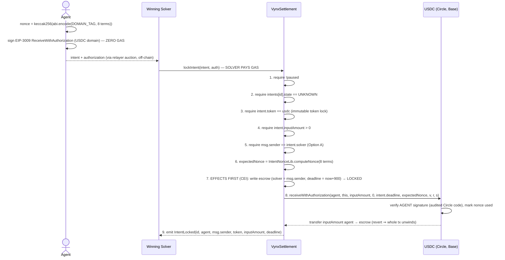
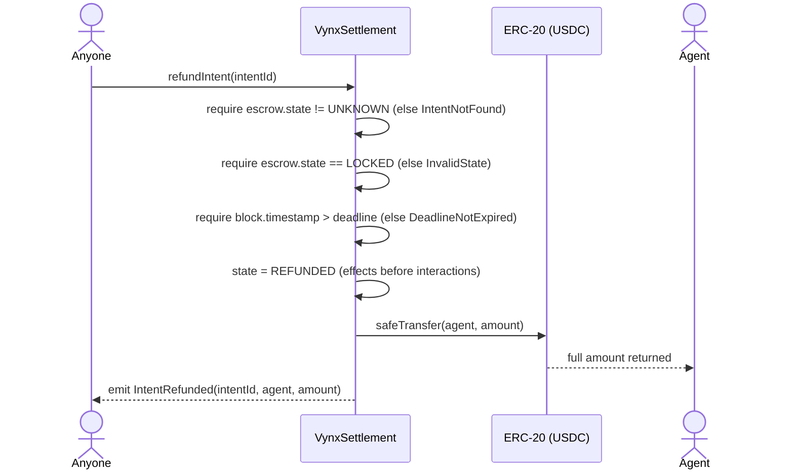
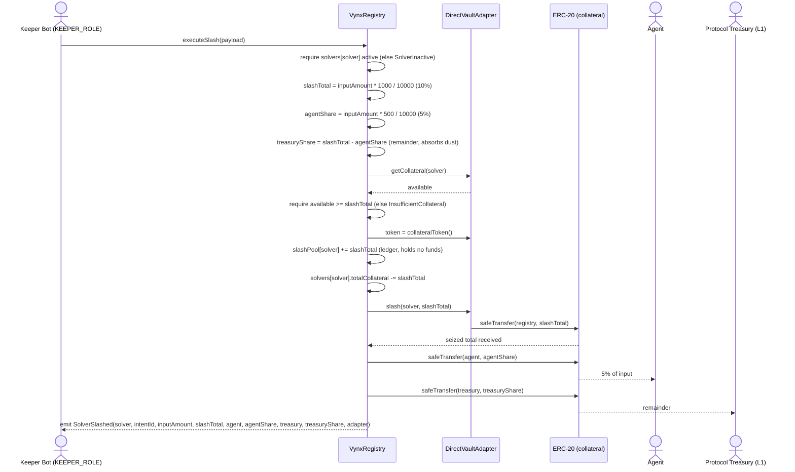

# VynX Settlement V1 — Protocol Flows

Mermaid sequence diagrams for the core protocol flows. Every diagram reflects the on-chain
behaviour implemented in `src/`. There is no on-chain bridge between L1 and L2; the two chains
are coordinated only by the off-chain relayer and Keeper Bot.

---

## 1. Intent Lock (Base L2) — gasless EIP-3009 custody

The agent signs **one** EIP-3009 `ReceiveWithAuthorization` off-chain (zero gas, no
`approve`) whose nonce is the keccak256 hash of all trade terms (§D2). The **winning solver**
executes `lockIntent` from its own address and pays all gas (§D5 Option A). The contract
recomputes the nonce from the submitted terms — never from calldata — and Circle's audited
USDC verifies the agent's signature: any tampered term makes the lock impossible. The §D3.6
canonical CEI order is pinned: **effects before interaction**.



---

## 2. Voucher Claim / Settlement (Base L2)

The solver redeems a relayer-signed voucher. Net proceeds go to the solver; the take-rate fee
goes to the Treasury, which is notified to update its accounting.

```mermaid
sequenceDiagram
    actor Solver
    participant Settlement as VynxSettlement
    participant Admin as VynxAdmin
    participant Token as ERC-20 (USDC)
    participant Treasury as VynxTreasury

    Solver->>Settlement: claimFunds(voucher)
    Settlement->>Settlement: require !paused
    Settlement->>Settlement: require escrow.state == LOCKED
    Settlement->>Settlement: require voucher.solver == escrow.solver
    Settlement->>Admin: relayerKey()
    Admin-->>Settlement: relayerKey
    Settlement->>Settlement: require ECDSA.recover(voucherDigest, sig) == relayerKey
    Settlement->>Settlement: state = REDEEMED (effects before interactions)
    Settlement->>Settlement: fee = amount * takeRateBps / 10_000; net = amount - fee
    Settlement->>Token: safeTransfer(solver, net)
    alt fee > 0
        Settlement->>Token: safeTransfer(treasury, fee)
        Settlement->>Treasury: receiveTakeRate(token, fee)
        Treasury->>Treasury: split 40/50/10 into accumulators
    end
    Settlement-->>Solver: emit VoucherRedeemed(id, solver, net, fee)
```

---

## 3. Refund After Deadline (Base L2)

Permissionless once the escrow deadline has passed. Returns the full escrowed amount to the
agent.



---

## 4. Revenue Distribution (Base L2)

The Treasury flushes accumulated real yield to StakingRewards, which begins (or rolls over) a
7-day USDC reward period for $VYNX stakers.

```mermaid
sequenceDiagram
    actor Caller as Admin or Keeper
    participant Treasury as VynxTreasury
    participant Token as ERC-20 (USDC)
    participant Staking as StakingRewards

    Note over Treasury: receiveTakeRate already split each inflow:<br/>toYield = amount*40/100, toBuyback = amount*50/100,<br/>toPol = amount - toYield - toBuyback
    Caller->>Treasury: distributeRealYield(token)
    Treasury->>Treasury: require caller == admin || caller == keeper
    Treasury->>Treasury: amount = yieldAccumulator[token]; require amount > 0
    Treasury->>Treasury: yieldAccumulator[token] = 0 (CEI)
    Treasury->>Token: safeTransfer(stakingRewards, amount)
    Treasury->>Staking: notifyRewardAmount(amount)
    Staking->>Staking: rewardRate set / rolled over; periodFinish = now + rewardsDuration (7d)
    Treasury-->>Caller: emit RealYieldDistributed(token, amount)
```

---

## 5. Relayer-Key Rotation (Base L2)

The watchdog rotates the relayer key. Because Settlement reads the key live on every call, the
new key is effective immediately with zero propagation delay.

```mermaid
sequenceDiagram
    actor Watchdog
    participant Admin as VynxAdmin
    participant Settlement as VynxSettlement

    Watchdog->>Admin: setRelayerKey(newKey)
    Admin->>Admin: require msg.sender == watchdog
    Admin->>Admin: require newKey != address(0)
    Admin->>Admin: oldKey = relayerKey; relayerKey = newKey
    Admin->>Settlement: syncConfig(takeRateBps, treasury)
    Note over Admin,Settlement: Only economic params are synced.<br/>relayerKey is NOT pushed — Settlement reads it<br/>live on the very next lockIntent / claimFunds.
    Admin-->>Watchdog: emit RelayerKeyRotated(oldKey, newKey)
```

---

## 6. On-Chain Solver Slash Distribution (Ethereum L1)

The Keeper Bot triggers a slash. The registry derives the split, the adapter transfers the
seized total into the registry, and the registry distributes both shares on-chain in the
adapter's collateral token. There is no off-chain bridge and no keeper compensation step in this
flow.



The emitted `SolverSlashed` event carries exactly nine fields, matching the on-chain
distribution. The signature carried in `SlashPayload` is retained for off-chain audit trails and
is not verified on-chain; authorisation is enforced solely by `KEEPER_ROLE`.
