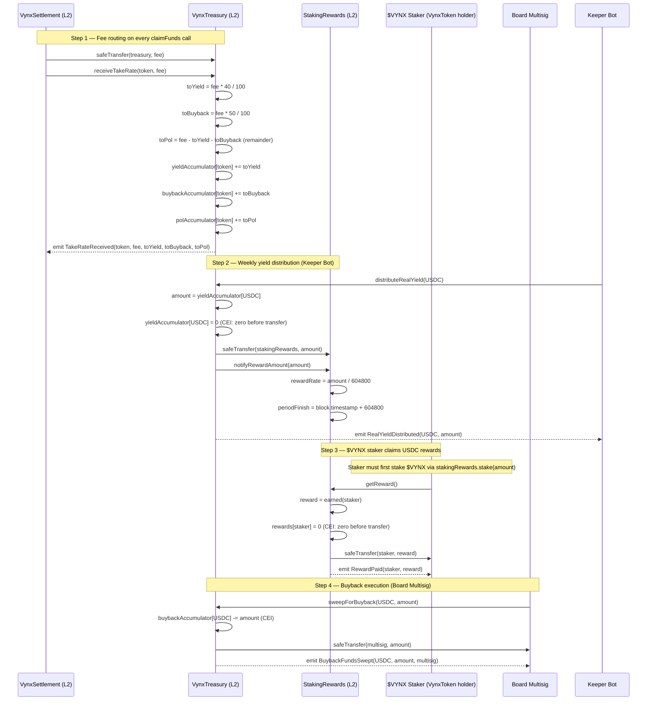
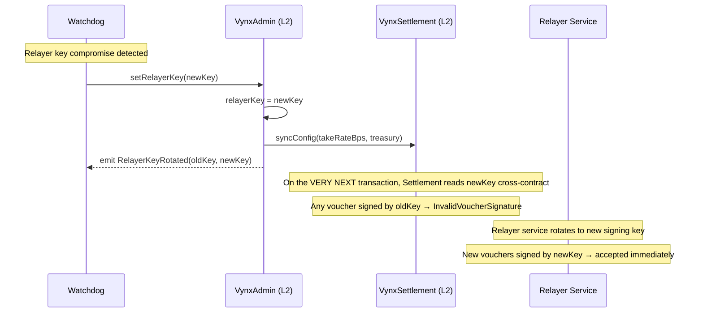
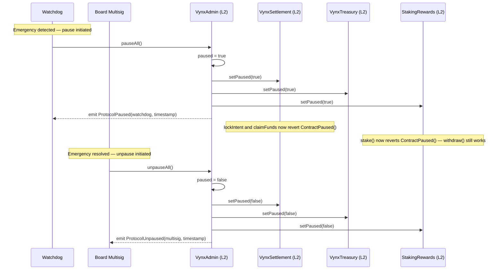
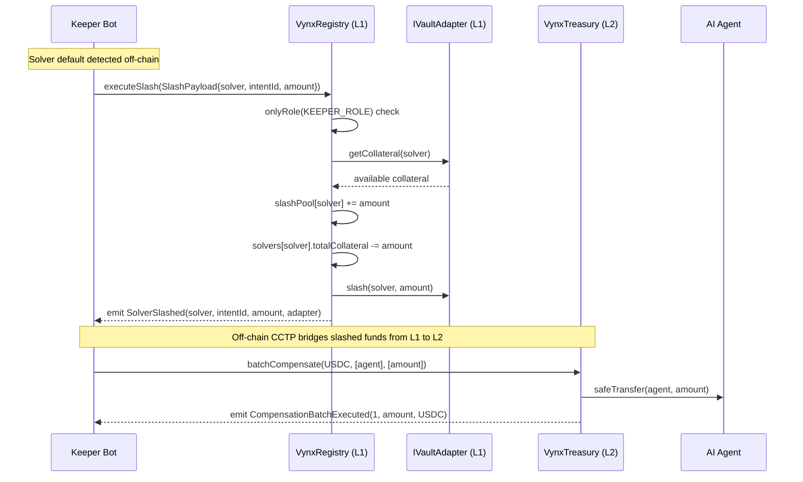

# VynX Settlement V1 — Protocol Flows

> Sequence diagrams for the three primary protocol flows. All diagrams use Mermaid syntax.

---

## 1. Intent Lifecycle — Happy Path

The complete flow from AI agent intent creation to solver settlement and optional refund.

```mermaid
sequenceDiagram
    participant Agent as AI Agent
    participant Relayer as Relayer Service
    participant Settlement as VynxSettlement (L2)
    participant Admin as VynxAdmin (L2)
    participant Treasury as VynxTreasury (L2)
    participant Solver as Solver

    Note over Agent,Relayer: Off-chain: Agent submits intent to Relayer
    Agent->>Relayer: Submit Intent(intentId, agent, token, amount, solver, nonce, destChainId)

    Note over Relayer: Relayer verifies solver eligibility via Registry.getSHF()
    Note over Relayer: Relayer signs EIP-712 Intent struct with relayerKey

    Relayer-->>Agent: Return relayerSig (EIP-712 signature)

    Note over Agent,Settlement: On-chain: Agent locks funds
    Agent->>Settlement: lockIntent(intent, relayerSig)
    Settlement->>Admin: relayerKey() [cross-contract read]
    Admin-->>Settlement: address relayerKey
    Settlement->>Settlement: ECDSA.recover(intentDigest, relayerSig) == relayerKey ?
    Settlement->>Settlement: state UNKNOWN → LOCKED
    Settlement->>Agent: safeTransferFrom(agent, settlement, amount)
    Settlement-->>Agent: emit IntentLocked(intentId, agent, solver, token, amount, deadline)

    Note over Solver,Relayer: Off-chain: Solver executes payment on destination chain
    Solver->>Relayer: Submit proof of destTx (destTxHash)
    Note over Relayer: Relayer verifies dest tx; signs EIP-712 Voucher(intentId, solver, amount)
    Relayer-->>Solver: Return voucher with relayer signature

    Note over Solver,Settlement: On-chain: Solver claims escrow funds
    Solver->>Settlement: claimFunds(voucher)
    Settlement->>Admin: relayerKey() [cross-contract read]
    Admin-->>Settlement: address relayerKey
    Settlement->>Settlement: ECDSA.recover(voucherDigest, voucher.sig) == relayerKey ?
    Settlement->>Settlement: voucher.solver == escrow.solver ?
    Settlement->>Settlement: state LOCKED → REDEEMED
    Settlement->>Solver: safeTransfer(solver, amount - fee)
    Settlement->>Treasury: safeTransfer(treasury, fee)
    Settlement->>Treasury: receiveTakeRate(token, fee)
    Settlement-->>Solver: emit VoucherRedeemed(intentId, solver, netAmount, fee)
```

---

## 2. Intent Refund Flow

When a solver fails to submit a voucher before the 900-second escrow deadline, anyone can trigger a refund.

```mermaid
sequenceDiagram
    participant Anyone as Anyone (agent, keeper, or third party)
    participant Settlement as VynxSettlement (L2)
    participant Agent as AI Agent

    Note over Agent: Intent was locked; solver never submitted voucher
    Note over Anyone: block.timestamp > escrow.deadline (900 seconds after lock)

    Anyone->>Settlement: refundIntent(intentId)
    Settlement->>Settlement: state == LOCKED ?
    Settlement->>Settlement: block.timestamp > deadline ?
    Settlement->>Settlement: state LOCKED → REFUNDED
    Settlement->>Agent: safeTransfer(agent, amount)
    Settlement-->>Anyone: emit IntentRefunded(intentId, agent, amount)
```

---

## 3. Revenue Distribution Flow

How protocol fees flow from Settlement through Treasury and into StakingRewards for `$VYNX` stakers. `$VYNX` (`VynxToken.sol`) is the native staking token — holders stake `$VYNX` and earn USDC yield proportional to their share of the staked supply.



---

## 4. Key Rotation Flow

Emergency procedure when the relayer key is compromised. The watchdog can rotate immediately without pausing the protocol.



---

## 5. Pause / Unpause Flow

Emergency pause propagation across all L2 contracts.



---

## 6. Solver Slashing Flow

L1 collateral confiscation when a solver defaults on an intent obligation.


